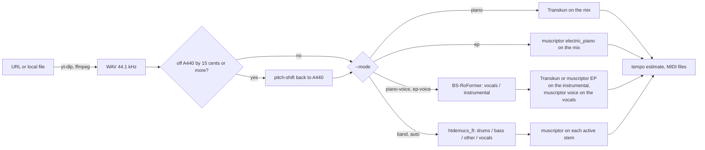

# transcribe

Turn a YouTube / Instagram / TikTok link, or a local audio or video file, into MIDI, picking the source-separation and transcription models by the kind of material.

## Why it exists

Joaquín Jacubowicz is a musician and producer who learns from reference tracks by transcribing them: voicings from a piano cover on Instagram, a bass line from a record, the drum pattern under a vocal. Doing that by ear is slow, and running one audio-to-MIDI model on a full mix tangles the instruments together. In the author's experience, separating the parts first and using a model suited to each part gives much cleaner MIDI.

`transcribe` puts those steps into one command: download, tuning correction, source separation only when it is needed, per-part transcription with the model suited to that part, and MIDI files written at an estimated tempo so they line up with the audio in a DAW (the author uses Ableton Live).

## How it works



### Which model for which material

| `--mode` | Material | Separation | Transcription |
|---|---|---|---|
| `piano` | solo acoustic piano | none | Transkun on the mix |
| `ep` | solo electric piano (Rhodes, Wurlitzer) | none | muscriptor restricted to `electric_piano` |
| `piano-voice` | acoustic piano and voice | BS-RoFormer, 2 stems | Transkun on the instrumental, muscriptor `voice` on the vocals |
| `ep-voice` | electric piano and voice | BS-RoFormer, 2 stems | muscriptor `electric_piano` on the instrumental, `voice` on the vocals |
| `band` | anything else | htdemucs_ft, 4 stems | muscriptor per stem: `drums`, `electric_bass` (or `--bass acoustic_bass`), `voice`, and the Other stem unrestricted (or `--other transkun` / `--other <muscriptor group>`) |
| `auto` | unknown | htdemucs_ft, 4 stems | chooses one of the above from stem energies and the video's title, description and tags |

The reasoning behind these choices:

- **Transkun for acoustic piano.** Transkun is a piano transcription model that outputs per-note velocities and the sustain pedal (CC64), which matters when the goal is to study voicings and phrasing. A solo piano recording is not separated at all: separation would only add artefacts.
- **muscriptor for everything else.** muscriptor is a multi-instrument transcription model that can be restricted to an instrument group (`voice`, `drums`, `electric_bass`, `electric_piano`, `organ`, ...).
- **Electric piano is not Transkun's job.** Transkun is trained on acoustic piano. On one Rhodes-type electric piano stem, Transkun produced 42 notes, left about 40% of the playing without notes and reached a chroma similarity of 0.40 against the stem. muscriptor restricted to `electric_piano` produced 98 notes and 0.83 (unrestricted muscriptor 0.76).
- **Only as much separation as needed.** A solo keyboard gets no split. Piano plus voice only needs a vocals/instrumental split, done with BS-RoFormer, the best vocal separator among the models the author tried. A band gets the 4-stem htdemucs_ft split, and muscriptor runs on each stem holding at least 1% of the total stem energy.

### Details that affect accuracy

- **Tuning.** Transcribers round to the nearest semitone, so a recording that is off A440 (worst near a quarter tone) produces notes a semitone off. The offset is measured with librosa on the harmonic part of the first 180 s. With `--tune auto` (default), audio 15 cents or more off is shifted back as `<Name> +47c.wav` (the number is the shift), and stems and MIDI are made from that file. The shift uses ffmpeg `asetrate` + `atempo` and is padded back to the original length, so timing is kept (upward shifts within about 3 ms; downward shifts can wobble locally by up to about 20 ms, without drift). Near a quarter tone the key is ambiguous and the script prints the alternative `--tune` value.
- **muscriptor timing.** muscriptor is run with `--detect-tempo false` on the audio with 1 s of silence prepended; the notes are shifted back afterwards and anything past the end of the audio is dropped. Its tempo detection shifts the whole timeline to put the first detected downbeat on a bar line (one test came out a full bar late), and without lead-in it misses notes in the first ~0.5 s. The end is never padded: muscriptor works in 5 s chunks and fills a mostly silent last chunk with invented notes.
- **Velocity.** muscriptor writes every note at velocity 100, so its notes are set to a flat 50 (`--velocity`). Transkun parts keep their own dynamics.
- **Tempo.** All MIDI files share one tempo: the strongest tempogram peak between 60 and 150 BPM is used as a prior for beat tracking, and a straight-line fit through the beat times gives the period. In `band` mode the tempo is then refined, within ±4%, to the value whose 16th-note grid best fits the transcribed drum hits. It is rounded to 2 decimals, so setting the DAW to exactly that BPM lines the MIDI up with the WAV. On rubato playing the number is only nominal.
- **Stem levels.** Stems are written by the bundled `stems` script without its true-level flag. audio-separator then scales the input and each stem down independently when their peak exceeds 0.9, so the stems do not sum back to the mix. That does not matter for note detection. The `-t` flag, which keeps true level, is used by the companion tool [`multitrack-stems`](https://github.com/joaquinjacu/multitrack-stems).

### `auto` mode rules

After the 4-stem split, using stem energy shares and the video's title, description, uploader and tags:

1. drums ≥ 3% or bass ≥ 5% → `band`
2. Other < 5% (e.g. a cappella) → `band`
3. the text names a non-piano instrument and never piano → `band`
4. vocals ≥ 3% → `ep-voice` if the text names Rhodes / Wurli / electric piano, else `piano-voice`
5. the text names an electric piano → `ep`
6. otherwise → `piano`

The chosen mode and the reason are printed; re-run with an explicit `--mode` if it is wrong (the WAV and stems are reused).

## Requirements

Tested on macOS (Apple Silicon, M3 Pro). The code has no macOS-only parts besides clearing a Finder flag, which is skipped elsewhere, but Linux is untested. Windows is not supported (the helper is a bash script).

- **Python 3.11 environment** with `numpy`, `soundfile`, `librosa`, `pretty_midi` and `transkun` (see `requirements.txt`). Transkun pulls in PyTorch and ships its pretrained weights inside the pip package.
- **[muscriptor](https://github.com/muscriptor/muscriptor)** (Python ≥ 3.10), on PATH. Its weights are hosted on Hugging Face and gated behind the CC BY-NC 4.0 licence: create a free Hugging Face account, accept the licence on the [muscriptor-medium](https://huggingface.co/MuScriptor/muscriptor-medium) page (and `-small` / `-large` if used), then log in with `uvx hf auth login` or set `HF_TOKEN`. Weights are downloaded and cached on first use.
- **[audio-separator](https://github.com/karaokenerds/python-audio-separator)**, used by the bundled `stems` script. It downloads the separation weights on first use (see [Models](#models)).
- **ffmpeg** and **yt-dlp** on PATH.

## Install

```bash
git clone <this repo> transcribe && cd transcribe

# Python environment for transcribe.py
python3.11 -m venv .venv
.venv/bin/pip install -r requirements.txt

# muscriptor and audio-separator, each in its own isolated environment (https://docs.astral.sh/uv/)
uv tool install muscriptor
uv tool install "audio-separator[cpu]" --with audioread --python 3.12   # [gpu] for CUDA
uvx hf auth login            # after accepting the muscriptor licence on Hugging Face

# ffmpeg and yt-dlp (macOS, Homebrew)
brew install ffmpeg yt-dlp

# a `transcribe` command on PATH that uses the venv's Python
mkdir -p ~/.local/bin
printf '#!/bin/bash\nexec "%s/.venv/bin/python" "%s/transcribe.py" "$@"\n' "$PWD" "$PWD" > ~/.local/bin/transcribe
chmod +x ~/.local/bin/transcribe
```

`stems` does not need to be on PATH: `transcribe.py` uses the copy next to it.

## Usage

```bash
# solo piano video: no separation, Transkun on the mix
transcribe "https://www.youtube.com/watch?v=<id>" --mode piano

# piano and voice, only the 0:30 to 1:15 section
transcribe "<url>" --mode piano-voice --start 0:30 --end 1:15

# a band recording with a Rhodes; no MIDI for the rap vocal
transcribe song.mp3 --mode band --other electric_piano --skip vocals

# piano trio: Transkun on the Other stem, upright bass
transcribe "<url>" --mode band --other transkun --bass acoustic_bass

# not sure what it is
transcribe "<url>" --mode auto

# Instagram posts that need a login
transcribe "<instagram url>" --mode ep --cookies-from-browser chrome
```

Other options: `--name` (folder and file base name; default from the title), `--tune auto|off|<cents>`, `--velocity N`, `--model small|medium|large` (muscriptor size), `--out <parent folder>`. Run `transcribe --help` for the full list.

Re-running on the same source reuses the WAV and stems, so switching `--mode` is cheap; MIDI files from the previous run that the new run did not produce are removed.

### Configuration

| Variable | Default | Meaning |
|---|---|---|
| `TRANSCRIPTIONS_DIR` | `./Transcriptions` | parent folder for results (`--out` overrides it) |
| `TRANSKUN` | `transkun` next to the running Python, else PATH | Transkun CLI |
| `MUSCRIPTOR` | `muscriptor` on PATH | muscriptor CLI |
| `STEMS_CMD` | the `stems` script next to `transcribe.py`, else PATH | separation helper |
| `STEMS_MODEL_DIR` | `~/audio-separator-models` | where separation weights are cached |
| `AUDIO_SEPARATOR` | `~/.local/bin/audio-separator`, else PATH | audio-separator CLI |

## Output

```
$TRANSCRIPTIONS_DIR/<Name> MIDI/
    <Name>.wav                 source audio (44.1 kHz, 16-bit)
    <Name> +47c.wav            retuned copy, only when the source was off A440
    stems/                     htdemucs_ft 4 stems, or BS-RoFormer vocals/instrumental
    <Name> - <Part>.mid        one file per part: Piano, EP, Vocals, Drums, Bass, Other / Keys
    <Name> - Full.mid          all parts, one track each (when there is more than one part)
    <Name> - All.mid           every non-drum part merged into one track, so it drops into
                               a DAW as a single clip (when there are two or more pitched parts)
    .transcribe.json           source, mode and reason, tuning, shift, BPM, stem energies, outputs
```

Names come from the video title without "(Official Video)" and similar; Instagram and TikTok posts become `<uploader> IG <id>` / `<uploader> TikTok <id>`. `--start/--end` add a suffix such as ` 30-75s`.

In `All.mid`, same-pitch notes from different parts would cut each other off on one channel, so duplicates less than 30 ms apart are merged and an earlier overlapping note is shortened. The sustain pedal from Transkun parts is kept.

## Use as a Claude Code skill

`skill/SKILL.md` is a Claude Code skill that wraps this tool. Copy it to `~/.claude/skills/transcribe/SKILL.md` and make sure `transcribe` is on PATH. When asked to transcribe a link, Claude first asks what the material is (piano, electric piano, piano and voice, band, unsure) so no unneeded separation runs, then runs the command with a long timeout and reports the folder, the mode and why, the tuning, each MIDI file with its note count, and the BPM to set in the DAW.

## The `stems` helper

`stems` is a small bash wrapper around audio-separator with short model names (`ft`, `6s`, `rofo`, `dual`, `mdx23c`, or any model filename), folder input, and a `-t` true-level mode. The same script is included in the companion repository [`multitrack-stems`](https://github.com/joaquinjacu/multitrack-stems), which uses `-t` for every stage; the two copies are identical. `stems -h` prints its options.

## Models

| Model | Used for | Weights |
|---|---|---|
| Transkun 2.0 | acoustic piano | included in the `transkun` pip package |
| muscriptor `medium` (default; `small`, `large` with `--model`) | all other parts | Hugging Face [MuScriptor](https://huggingface.co/MuScriptor), gated, cached on first use |
| htdemucs_ft (Demucs v4) | 4-stem split | downloaded by audio-separator from `dl.fbaipublicfiles.com` (4 files, about 84 MB each) |
| BS-RoFormer `model_bs_roformer_ep_317_sdr_12.9755` | vocals / instrumental | downloaded by audio-separator from the model repository listed in its registry |

Separation weights go to `~/audio-separator-models` (or `$STEMS_MODEL_DIR`). On the author's M3 Pro, htdemucs_ft takes about half the audio's length and BS-RoFormer about twice the audio's length.

## Limitations

- The MIDI is a starting point, not a finished transcription. Dense mixes, distorted instruments and bleed between stems produce wrong and missing notes; the htdemucs_ft Other stem holds everything that is not drums, bass or vocals, so unrestricted muscriptor on it can mix instruments together.
- One fixed tempo per file. Tempo changes and rubato are not followed.
- muscriptor gives no dynamics (flat velocity).
- `auto` mode relies on energy thresholds and keywords in the video text. The energy shares are computed on stems written without true level, so a stem that peaked above 0.9 can be slightly under-weighted.
- Downward pitch shifts can move notes locally by up to about 20 ms (the shift uses ffmpeg's `asetrate`/`atempo`, not rubberband).
- Downloading from video platforms is subject to their terms of service. Audio and MIDI derived from commercial recordings are for personal study and should not be redistributed.

## Credits and licences

The tools and models this repository calls have their own licences:

| Component | Role | Licence |
|---|---|---|
| [Transkun](https://github.com/Yujia-Yan/Skipping-The-Frame-Level) (Yujia Yan, Zhiyao Duan, Frank Cwitkowitz) | piano transcription | code MIT; the package states no separate licence for the bundled weights |
| [muscriptor](https://github.com/muscriptor/muscriptor) (Kyutai and Mirelo) | multi-instrument transcription | code MIT; **weights CC BY-NC 4.0 (non-commercial)** |
| [audio-separator](https://github.com/karaokenerds/python-audio-separator) | runs the separation models | MIT |
| [Ultimate Vocal Remover](https://github.com/Anjok07/ultimatevocalremovergui) (Anjok07, aufr33) | model repository and most of audio-separator's code | MIT; audio-separator asks users of UVR models to credit UVR and its developers |
| [Demucs](https://github.com/facebookresearch/demucs) v4, htdemucs_ft (Meta) | 4-stem separation | MIT |
| BS-RoFormer checkpoint by viperx | vocals / instrumental | no licence stated in audio-separator's model registry; not verified |
| [yt-dlp](https://github.com/yt-dlp/yt-dlp) | download | Unlicense |
| [FFmpeg](https://ffmpeg.org) | decoding, resampling, pitch shift | LGPL 2.1+ or GPL depending on the build; called as an external program |
| [librosa](https://librosa.org) | tuning, tempo | ISC |
| [pretty_midi](https://github.com/craffel/pretty-midi) | MIDI I/O | MIT |
| [python-soundfile](https://github.com/bastibe/python-soundfile) | audio I/O | BSD 3-Clause |
| [NumPy](https://numpy.org) | arrays | BSD 3-Clause |

Papers:

- Yujia Yan and Zhiyao Duan, "Scoring intervals using non-hierarchical transformer for automatic piano transcription", ISMIR 2024. Yujia Yan, Frank Cwitkowitz and Zhiyao Duan, "Skipping the Frame-Level: Event-Based Piano Transcription With Neural Semi-CRFs", NeurIPS 2021.
- Simon Rouard, Michael Krause, Axel Roebel, Carl-Johann Simon-Gabriel and Alexandre Défossez, "MuScriptor: An Open Model for Multi-Instrument Music Transcription", arXiv:2607.08168, 2026.
- Simon Rouard, Francisco Massa and Alexandre Défossez, "Hybrid Transformers for Music Source Separation", ICASSP 2023.
- "Music Source Separation with Band-Split RoPE Transformer" (BS-RoFormer), ByteDance, 2023.

---

Written by Joaquín Jacubowicz. Built with [Claude Code](https://claude.com/claude-code): the author designed the tool, directed the agent and tested the results.
